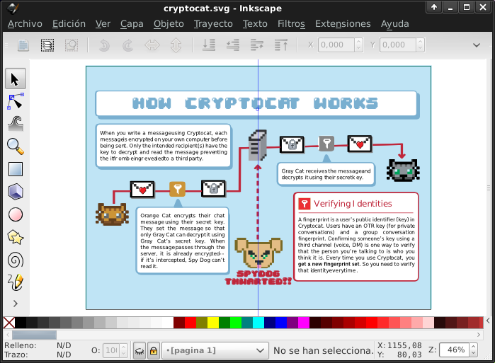

GuiaCryptoCat
=============

Mini manual de CryptoCat

Traducción y rearmado para que sea mas libre que la versión [original](https://github.com/cryptocat/cryptocat-meta).

Edición
-------

Para editar el documento uso [Inkscape](http://inkscape.org/)

### Fuentes tipográficas

Si no tenes las tipografias tenes que instalarlas

<pre>
mkdir ~/.fonts
cp ttf/04b30.ttf ~/.fonts
</pre>

